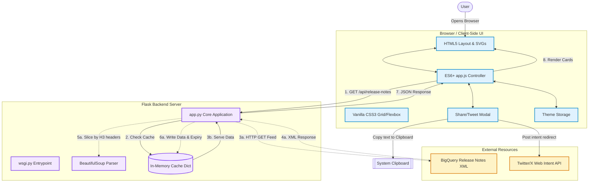

# System Architecture: BigQuery Release Notes Dashboard

This document details the architectural layout, component interactions, and data flows of the BigQuery Release Notes Dashboard.

---

## 🏗️ System Component Map

---

## 📂 Component Responsibilities

### 1. Browser Client-Side
* **HTML/CSS:** Handles structural grids, cards rendering, glassmorphic themes (dark/light), and skeleton loading animations.
* **JavaScript (`app.js`):**
  * Controls view states (loading, empty filters, cards grid).
  * Executes client-side filters (by keyword search, category pills) and date-based sorting.
  * Formats custom tweet strings based on selected card contents, validating length limitations (280 characters).
  * Manages theme toggling and persists selection using local storage (`localStorage`).

### 2. Flask Backend Application
* **Flask Router (`app.py`):** Serves the main template index route (`/`) and handles API requests (`/api/release-notes`). Supports a force-refresh trigger (`?refresh=true`).
* **XML Parsing Engine:** Utilizes Python's standard `xml.etree.ElementTree` to identify entries, extracting metadata like entry titles (dates) and update links.
* **BeautifulSoup Segmenter:** Parses raw HTML nested inside Atom CDATA blocks, dividing content into discrete updates sorted by type (Feature, Change, Issue, Deprecation).
* **Caching Layer:** Stores parsed JSON payloads in-memory, locked to a 10-minute timeout. This avoids rate-limiting, handles fallback returns in case the external feed is offline, and reduces API loading latencies.

### 3. External integrations
* **Google Cloud Feed:** The source feed hosting BigQuery updates.
* **Twitter/X Intent API:** Used to securely pre-populate posts for sharing via URL redirects, avoiding API writes or keys.
